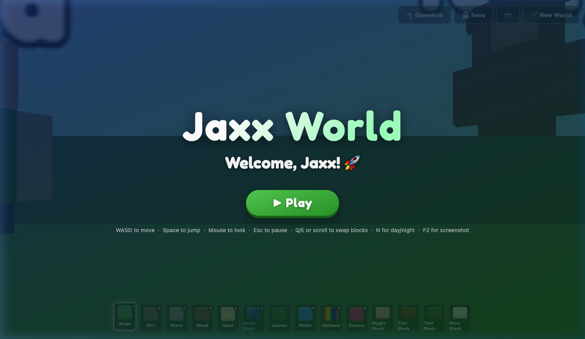

# 🚀 Jaxx's BlockVenture

A browser-based voxel building game made with love for my son **Jaxx** (age 6–9). No installs, no accounts — just open and play. Built entirely from a single HTML file using **Three.js**, vanilla JavaScript, and way too many late nights.



## 🎮 How to Play

Open `game.html` in Chrome (or any modern browser) and click **▶ Play**. That's it!

You can also serve it locally:
```bash
python3 -m http.server 8765
```
Then open [http://localhost:8765/game.html](http://localhost:8765/game.html)

## 🕹️ Controls

### Desktop (Keyboard + Mouse)

| Action | Key |
|--------|-----|
| Move | `W` `A` `S` `D` |
| Look around | Mouse |
| Jump | `Space` |
| Select block | `1`–`9`, `0` |
| Cycle blocks | `Q` / `E` or scroll wheel |
| Break block | Left click |
| Place block | Right click |
| Toggle day/night | `N` |
| Screenshot | `F2` |
| Photo mode (free-fly) | `F3` |
| Pause | `Esc` |

### Tablet / Touch

| Action | Gesture |
|--------|---------|
| Move | Virtual joystick (bottom-left) |
| Look around | Drag on screen |
| Jump | ⤴ button |
| Break / Place | ⛏ / ⬛ buttons |
| Select block | Tap hotbar slot |

## 🧱 Block Types

| # | Block | What it does |
|---|-------|-------------|
| 1 | 🟩 Grass | Standard terrain block |
| 2 | 🟫 Dirt | Underground layer |
| 3 | ⬜ Stone | Deep underground |
| 4 | 🪵 Wood | Tree trunks, building material |
| 5 | 🟨 Sand | Found near water |
| 6 | 🔵 Astro Block | Jaxx's personal space-themed block! |
| 7 | 🌿 Leaves | Tree canopy |
| 8 | 🌊 Water | Semi-transparent, fills oceans |
| 9 | 🌈 Rainbow | Smoothly cycles through all colours |
| 0 | 🩷 Bouncy | Plays "boing!" and bounces you when stepped on |
| — | 😂 Giggle Block | Plays a giggle sound when placed |
| — | 🐄 Cow Block | Mooooo! |
| — | 💨 Toot Block | ...you know what this one does |
| — | 💡 Glow Block | Emits light — essential for nighttime builds |

## ✨ Features

- **Procedural terrain** with simplex noise — hills, valleys, trees, oceans and sandy shores
- **Day/Night cycle** with sun and moon rotation, smooth sky colour transitions
- **Physics** — gravity, jumping, collision detection, and sliding along walls
- **Sound effects** — all synthesised in-code (no audio files needed!)
- **Save/Load** — your world is automatically saved to localStorage
- **Photo Mode** (F3) — free-fly camera for capturing your creations
- **Touch support** — fully playable on iPad and tablets
- **NPCs** — friendly characters with floating name tags
- **Hidden Easter egg** — can you find the secret room? 🤫

## 🏗️ How We Built It

This entire game was built by a **non-coder dad** pair-programming with **AI**. Every feature was tracked as a Linear issue, implemented one task at a time, and tested by a very enthusiastic 7-year-old QA engineer.

### Milestone History

| Version | Milestone | What was added |
|---------|-----------|---------------|
| v1 | Foundation | Basic 3D world, camera, first blocks |
| v2 | Block Interaction | Break & place blocks with mouse |
| v3 | Building Tools | Hotbar, block types, sounds |
| v4 | Persistence | Save/load worlds to localStorage |
| v5 | Polish | Title screen, touch controls, screenshot |
| v6 | Terrain & Weather | Procedural terrain, trees, water, day/night |
| v7 | Fun & Magic | Rainbow, bouncy, sound, glow blocks, NPCs, Easter egg, photo mode |

## 📁 Tech Stack

- **Single HTML file** — no build tools, no npm, no frameworks
- **Three.js 0.160.0** (pinned from CDN)
- **SimplexNoise 2.4.0** for terrain generation
- **Web Audio API** for all sound effects
- **localStorage** for world persistence

## 📜 Rules We Follow

- ✅ Kid-safe: no combat, no failure states, no scary content
- ✅ No loud sounds, no flashing, nothing that could startle a child
- ✅ Works offline after first load
- ✅ Zero dependencies to install

---

*Built for Jaxx, with love. 💙*
